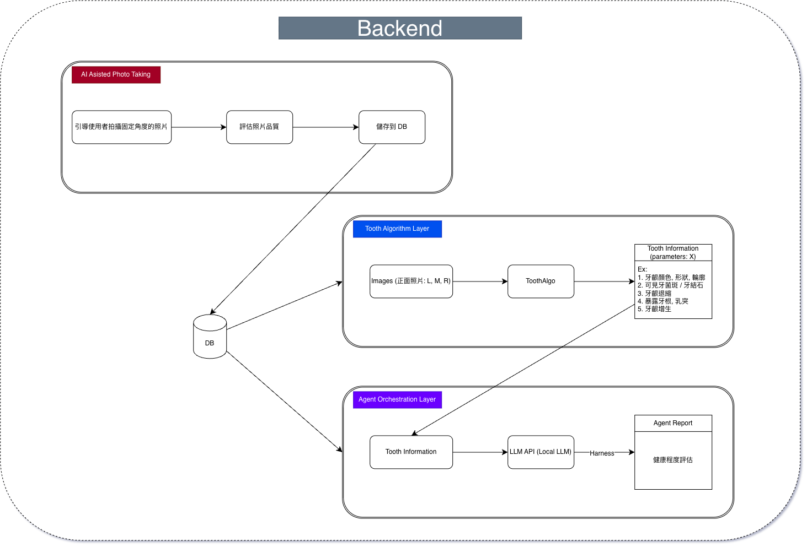

# ToothAI_Project

## 專案背景與動機
本專案志在開發針對學齡孩童的口腔保健及量化追蹤AI應用，透過醫學影像分析技術從口內相片量化資訊，提供雲端口牙檢查，紀錄追蹤功能，萃取出的資訊 (或許可以研究時序關係, 但基本上會遇到資料瓶頸的問題。ps. 創業比賽可以畫大餅) 可以透過 LLM 分析報告書提供醫師或家長初步報告以追蹤觀察幼齡孩童口牙保健。
    
    相較於 CBCT, X光片等等放射影像可以提供更多細節，這部分的應用較多人在做，而口內照片的應用相對較少人研究 (暑假和學長及醫師的會議中提到的)。

## 系統架構規劃
> 初期雛形想法

## 專案預期功能

### 1. 引導拍攝特定角度口內照片 (或許需要口角擴張器輔助)
需要設計一套流程輔助使用者用手機拍攝特定角度的照片，以提供演算法分析。
> ...

### 2. 基於口內照片的量化演算法
目前正在研究的是 X 光片的CRR (Crown to Ratio)，更多演算法需研究...

以下是可研究的量化表徵:
- 牙齦顏色、輪廓、腫脹
- 可見牙菌斑 / 牙結石
- 牙齦退縮
- 暴露牙根、乳突
- 牙齦增生
### 3. LLM Agent 的報告書，健康評估

> 更多待思考...
